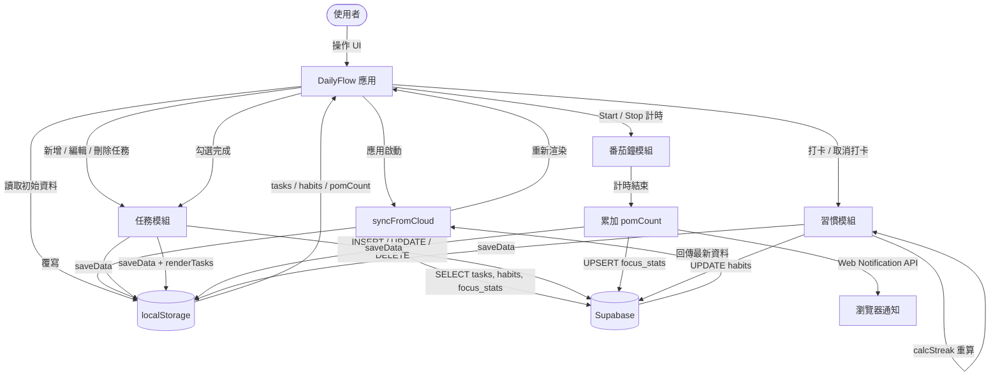
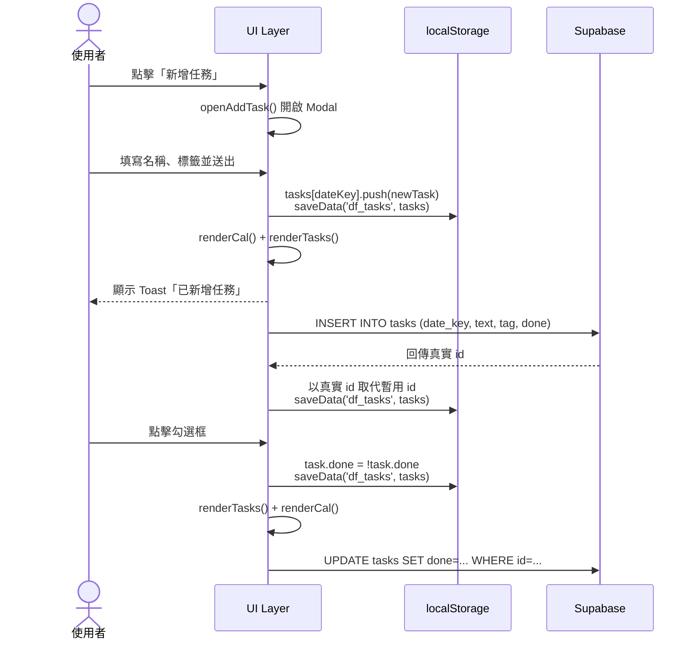
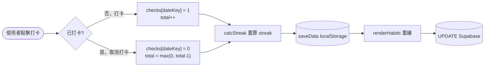
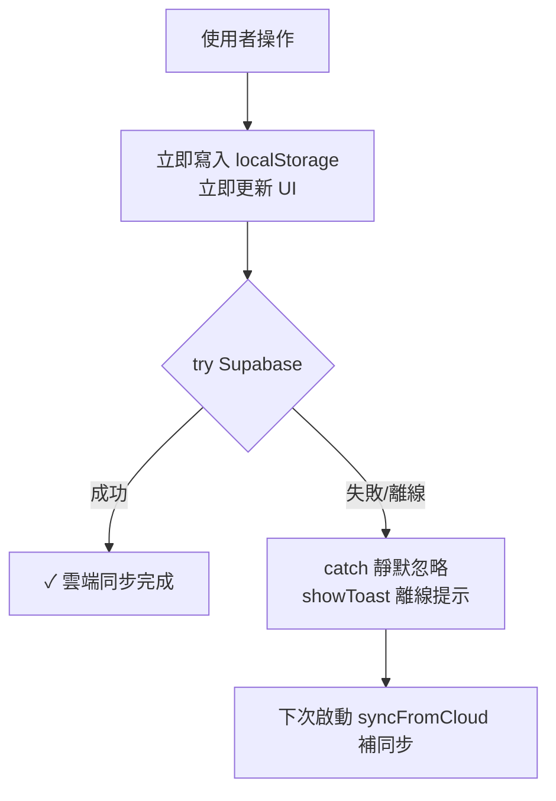
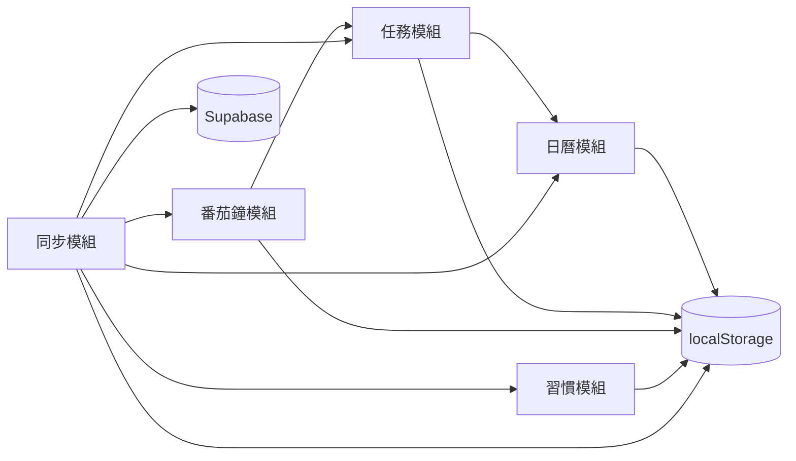

# DailyFlow 系統分析文件

## 1. 需求說明

### 1.1 專案概覽

DailyFlow 是一款行動優先的 PWA（Progressive Web App），整合三大日常生產力功能：日曆任務管理、番茄鐘專注計時、習慣打卡追蹤。採用離線優先策略，本地 localStorage 為主要資料存取層，Supabase 提供跨裝置雲端同步。

### 1.2 功能性需求

| 編號 | 模組 | 需求描述 | 優先級 |
|------|------|----------|--------|
| FR-01 | 日曆 | 依日期瀏覽月曆，點擊日期切換當日任務清單 | 高 |
| FR-02 | 任務 | 新增、編輯、刪除任務；支援三種分類標籤（工作/生活/健身） | 高 |
| FR-03 | 任務 | 勾選完成任務，任務名稱顯示刪除線 | 高 |
| FR-04 | 番茄鐘 | 支援專注 25min / 短休息 5min / 長休息 15min 三種模式 | 高 |
| FR-05 | 番茄鐘 | 計圈數與今日專注分鐘，圓環動畫視覺化進度 | 中 |
| FR-06 | 番茄鐘 | 隨機從待辦選取「目前專注任務」 | 低 |
| FR-07 | 習慣 | 新增、編輯、刪除習慣；支援 8 種 Emoji 圖標 | 高 |
| FR-08 | 習慣 | 每日打卡並顯示本週 7 天打卡狀態 | 高 |
| FR-09 | 習慣 | 動態計算連續達成天數（Streak）與累計總天數 | 高 |
| FR-10 | 習慣 | 可折疊的過去 4 週熱力圖 | 中 |
| FR-11 | 同步 | 應用啟動時自動從 Supabase 拉取最新資料 | 高 |
| FR-12 | 同步 | 每次操作後即時同步至 Supabase，失敗靜默降級 | 高 |
| FR-13 | 通知 | 番茄鐘完成時觸發瀏覽器推播通知 | 中 |
| FR-14 | 首次使用 | 無習慣資料時自動建立三筆預設習慣 | 低 |

### 1.3 非功能性需求

| 編號 | 類別 | 描述 |
|------|------|------|
| NFR-01 | 離線支援 | Service Worker 快取靜態資源，斷網仍可正常操作 |
| NFR-02 | 可安裝性 | 符合 PWA 規範（manifest.json），可加入主畫面 |
| NFR-03 | 響應式 | 最大寬度 480px，適配手機螢幕，支援 safe-area-inset |
| NFR-04 | 深色模式 | 透過 `prefers-color-scheme: dark` 自動切換 CSS 變數 |
| NFR-05 | 效能 | 操作後立即更新本地 UI，不等待雲端回應 |
| NFR-06 | 可及性 | 所有互動元素具備 `aria-label`；鍵盤 Enter/Escape 支援 |

---

## 2. 資料流程圖

### 2.1 系統整體資料流

### 2.2 任務 CRUD 資料流

### 2.3 習慣打卡資料流

### 2.4 離線降級流程

---

## 3. 元件說明表

### 3.1 UI 元件

| 元件 ID | 名稱 | 類型 | 說明 |
|---------|------|------|------|
| `.app` | 應用容器 | 佈局 | Flex 縱向佈局，最大寬 480px，居中顯示 |
| `.header` | 頂部標題列 | 導覽 | 顯示頁面標題、待辦摘要、同步/通知按鈕 |
| `.tab-bar` | 底部導覽列 | 導覽 | 三個 Tab（日曆/專注/習慣），active 狀態藍色底線 |
| `.content` | 主內容區域 | 佈局 | 可垂直捲動，包含三個 `.section` |
| `#tab-cal` | 日曆頁 | 頁面 | 包含月曆格、任務清單、新增按鈕 |
| `#tab-focus` | 專注頁 | 頁面 | 包含模式選擇、圓環計時器、統計數據 |
| `#tab-habit` | 習慣頁 | 頁面 | 包含統計橫幅、週視圖、習慣卡片列表 |
| `.cal-grid` | 月曆格 | 展示 | 7 欄 Grid，顯示當月日期，有任務的日期顯示紅點 |
| `.task-item` | 任務項目 | 互動 | 含勾選框、任務名、標籤、編輯/刪除按鈕 |
| `.ring-wrap` | 圓環計時器 | 展示 | SVG 圓環搭配絕對定位的時間文字 |
| `.hcard` | 習慣卡片 | 互動 | 含圖標、名稱、連續天數、本週打卡、進度條、熱力圖 |
| `.heat-wrap` | 習慣熱力圖 | 展示 | 可折疊，4×7 天格，深藍為今日 |
| `#task-modal` | 任務新增/編輯 Modal | 對話框 | 底部滑出 Sheet，含文字輸入與分類選擇 |
| `#habit-modal` | 習慣新增/編輯 Modal | 對話框 | 底部滑出 Sheet，含名稱輸入與 Emoji 選擇 |
| `#confirm-overlay` | 刪除確認對話框 | 對話框 | 置中顯示，取消/刪除兩按鈕 |
| `#toast` | Toast 通知 | 回饋 | 底部浮動，3 秒後自動消失 |
| `.sync-dot` | 同步指示點 | 回饋 | 右上角綠點，同步成功時閃現 2 秒 |

### 3.2 JavaScript 模組函式

| 函式名稱 | 所屬模組 | 說明 |
|----------|----------|------|
| `loadData(key, def)` | 工具 | 從 localStorage 讀取 JSON，失敗回傳預設值 |
| `saveData(key, val)` | 工具 | 將值序列化為 JSON 寫入 localStorage |
| `dateKey(d)` | 工具 | Date 物件轉 `YYYY-M-D` 字串（非零填充） |
| `todayKey()` | 工具 | 回傳今日的 dateKey |
| `selKey()` | 工具 | 回傳目前選取日期的 dateKey |
| `syncFromCloud()` | 同步 | 從 Supabase 拉取全量資料，覆寫 localStorage |
| `addDefaultHabits()` | 同步 | 首次使用時寫入三筆預設習慣至 Supabase |
| `switchTab(id, el)` | 導覽 | 切換 Tab，更新標題列文字 |
| `pendingSummary()` | 日曆 | 計算今日未完成任務數，回傳摘要字串 |
| `renderCal()` | 日曆 | 重新渲染月曆格（日期數字 + 任務紅點） |
| `selectDay(d)` | 日曆 | 更新選取日期，觸發重渲染 |
| `changeMonth(dir)` | 日曆 | 切換月份（±1） |
| `renderTasks()` | 任務 | 渲染選取日期的任務清單 |
| `toggleTask(k, id)` | 任務 | 切換任務完成狀態，同步 Supabase |
| `openAddTask()` | 任務 | 開啟新增 Modal，清空輸入 |
| `openEditTask(k, id)` | 任務 | 開啟編輯 Modal，填入既有資料 |
| `saveTask()` | 任務 | 新增或更新任務（依 `editingTaskId` 判斷模式） |
| `confirmDeleteTask(k, id, text)` | 任務 | 顯示確認對話框後刪除任務 |
| `setMode(m, el)` | 番茄鐘 | 切換計時模式，重置計時器 |
| `updateRing()` | 番茄鐘 | 更新時間文字與 SVG 圓環 dashoffset |
| `toggleTimer()` | 番茄鐘 | 開始/暫停計時，倒數歸零時累加圈數 |
| `resetTimer()` | 番茄鐘 | 重置計時器至當前模式初始秒數 |
| `skipTimer()` | 番茄鐘 | 跳過（等同重置） |
| `pickTask()` | 番茄鐘 | 隨機從未完成任務中選取並顯示 |
| `calcStreak(checks)` | 習慣 | 從今日往回回溯，計算連續打卡天數 |
| `renderHabitWeek()` | 習慣 | 渲染本週日期列（週日～週六） |
| `renderHabits()` | 習慣 | 渲染所有習慣卡片（含統計橫幅） |
| `toggleHabitDay(id, key)` | 習慣 | 打卡/取消打卡，重算 streak，同步 Supabase |
| `toggleHabitHistory(id)` | 習慣 | 切換習慣熱力圖折疊/展開 |
| `openAddHabit()` | 習慣 | 開啟新增習慣 Modal |
| `openEditHabit(id)` | 習慣 | 開啟編輯習慣 Modal，填入既有資料 |
| `saveHabit()` | 習慣 | 新增或更新習慣（依 `editingHabitId` 判斷模式） |
| `confirmDeleteHabit(id, name)` | 習慣 | 顯示確認對話框後刪除習慣及全部打卡記錄 |
| `showConfirm(title, msg, cb)` | 對話框 | 顯示確認對話框，設定回調函式 |
| `closeConfirm()` | 對話框 | 關閉確認對話框，清除回調 |
| `closeModal(id, e)` | Modal | 關閉指定 Modal（點擊 overlay 背景才關閉） |
| `showToast(msg, duration)` | 通知 | 顯示底部 Toast 訊息，預設 2200ms |
| `showNotifPrompt()` | 通知 | 請求瀏覽器通知授權 |
| `showSyncDot()` | 通知 | 顯示右上角同步綠點 2 秒 |

### 3.3 資料儲存結構

| localStorage Key | 資料類型 | 說明 |
|-----------------|----------|------|
| `df_tasks` | `Record<dateKey, Task[]>` | 所有日期的任務，以 dateKey 分組 |
| `df_habits` | `Habit[]` | 所有習慣（含 checks 打卡記錄） |
| `df_pom_YYYY-M-D` | `number` | 指定日期的番茄鐘完成圈數 |

### 3.4 Supabase 資料表

| 資料表 | 主要欄位 | 說明 |
|--------|----------|------|
| `tasks` | id, date_key, text, tag, done | 每日任務；date_key 格式 `YYYY-M-D` |
| `habits` | id, name, icon, color, streak, total, checks | 習慣；checks 為 JSONB 物件 |
| `focus_stats` | date_key, pom_count | 每日番茄鐘統計；以 date_key 作為唯一鍵 |

---

## 4. 模組依賴關係

